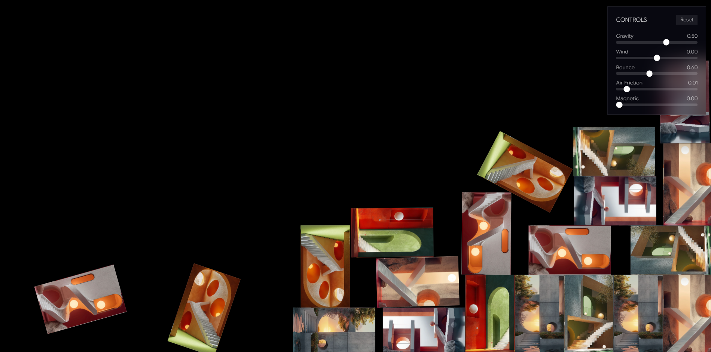

# 🪐 newTons — Interactive 2D Physics Sandbox

A premium, highly interactive 2D physics sandbox that blends modern web UI components with a powerful, real-time physics simulation. Drag, toss, bounce, and attract futuristic technology cards in a glassmorphic space.



---

## ✨ Features

- **🌐 Live 2D Physics Simulation**: Powered by `Matter.js` to handle realistic collisions, gravity, bounce, and forces directly on standard DOM elements.
- **🎛️ Real-Time Physics Controller**: A premium glassmorphic control sidebar that lets you manipulate the laws of physics on the fly:
  - **Gravity**: Change vertical gravity to float or crash the cards.
  - **Wind**: Apply continuous horizontal force to push cards left or right.
  - **Bounciness (Restitution)**: Adjust card elasticity from completely rigid to hyper-bouncy.
  - **Air Friction**: Modify drag to make movements snappy and light, or thick and sluggish.
  - **Magnetic Attraction**: Toggle a force field that pulls floating cards towards your mouse cursor or touch points with variable strength.
- **🖱️ Grab & Throw Interaction**: Smooth drag-and-drop physics constraint matching mouse and touch drag speed, allowing users to grab and fling cards naturally.
- **💎 Premium Design Aesthetics**:
  - Deep cyber-space dark mode.
  - Glassmorphism UI tokens, borders, and overlays.
  - Vivid cards featuring high-tech assets (*Neural Mesh*, *Quantum Render*, *Orbit DB*, etc.) mapping individual CSS `transform` matrices at 60fps.
- **📱 Fully Responsive**: Uses a dynamic `ResizeObserver` to rebuild collision walls automatically when resizing the window.

---

## 🛠️ Tech Stack

- **Frontend Core**: [React 18](https://react.dev/) + [Vite](https://vitejs.dev/)
- **Programming Language**: [TypeScript](https://www.typescriptlang.org/)
- **Physics Simulation**: [Matter.js 2D](https://brm.io/matter-js/)
- **Styling & Theme**: [Tailwind CSS](https://tailwindcss.com/)
- **Icons**: Custom SVG paths

---

## 🚀 Getting Started

### Prerequisites

Ensure you have [Node.js](https://nodejs.org/) installed on your machine.

### Installation

1. **Clone or open the directory**:
   ```bash
   cd newTons
   ```

2. **Install dependencies**:
   ```bash
   npm install
   ```

3. **Start the development server**:
   ```bash
   npm run dev
   ```

4. Open `http://localhost:5173` in your browser to experience the physics sandbox!

---

## 🏗️ Technical Architecture & Under the Hood

### The Physics Bridge (`usePhysicsEngine.ts`)

Instead of standard canvas rendering, this project maps **standard HTML React components** directly into **physical rigid bodies** in `Matter.js`. 

- **Custom Hook**: `usePhysicsEngine` handles initializing the physics engine, creating boundary walls, and keeping the state in sync.
- **The Main Loop**: A `requestAnimationFrame` loop handles updating the physics engine positions and directly setting CSS transforms:
  ```typescript
  el.style.transform = `translate(${body.position.x - bw / 2}px, ${body.position.y - bh / 2}px) rotate(${body.angle}rad)`;
  ```
  This offers a high-performance 60fps native feel without requiring heavy WebGL layers.
- **Dynamic Mouse Attraction**: Translates mouse/touch coordinates relative to the container and applies direct vector force to active bodies based on distance and magnetic pull coefficients:
  ```typescript
  const force = ctrl.magneticAttraction * 0.0004;
  Matter.Body.applyForce(body, body.position, {
    x: (dx / dist) * force,
    y: (dy / dist) * force,
  });
  ```

---

## 📂 Project Structure

```
newTons/
├── public/                 # Static assets (images, preview.png, favicon)
├── src/
│   ├── components/
│   │   ├── FloatingCard.tsx  # The physical technology cards
│   │   ├── Sidebar.tsx       # Glassmorphic controls panel
│   │   └── Sandbox.tsx       # Parent layout and container
│   ├── hooks/
│   │   └── usePhysicsEngine.ts # The Matter.js React coordinator
│   ├── App.tsx             # Main entry point
│   ├── style.css           # Global layout & Tailwind styles
│   ├── types.ts            # Common TypeScript declarations
│   └── main.tsx            # React bootstrap
├── package.json
└── tailwind.config.js
```
